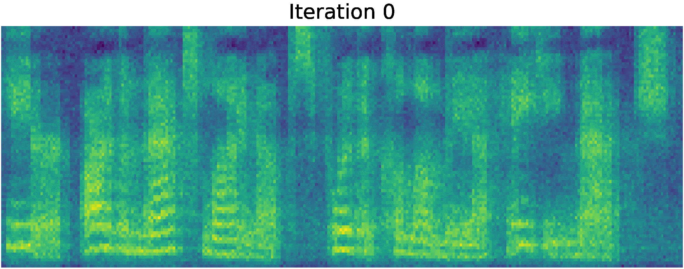

<p align="center">
    
</p>
## Installation

1: Clone this repository.
2: Install Perl library for French G2P
```bash
apt-get install libwww-perl -y
```
3. Install project requirements
```bash
pip3 install -r new_requirements.txt
```
4. 
Build `monotonic_align` code (Cython):

```bash
cd model/monotonic_align; python setup.py build_ext --inplace; cd ../..
```

Note: code is tested on Python==3.6.9.

5. Initialize and Update Submodule for Louisiana Creole TTS
""" 
git submodule init && git submodule update
"""

6. Install customized version of epitran. 
7. 
## References

* Grad-TTS is used as the basis for generating spectrograms [link](https://github.com/jik876/hifi-gan).
*  HiFi-GAN model is used as vocoder, official github repository: [link](https://github.com/jik876/hifi-gan).
* Monotonic Alignment Search algorithm is used for unsupervised duration modelling, official github repository: [link](https://github.com/jaywalnut310/glow-tts).
* Phonemization utilizes CMUdict, official github repository: [link](https://github.com/cmusphinx/cmudict).
* 
